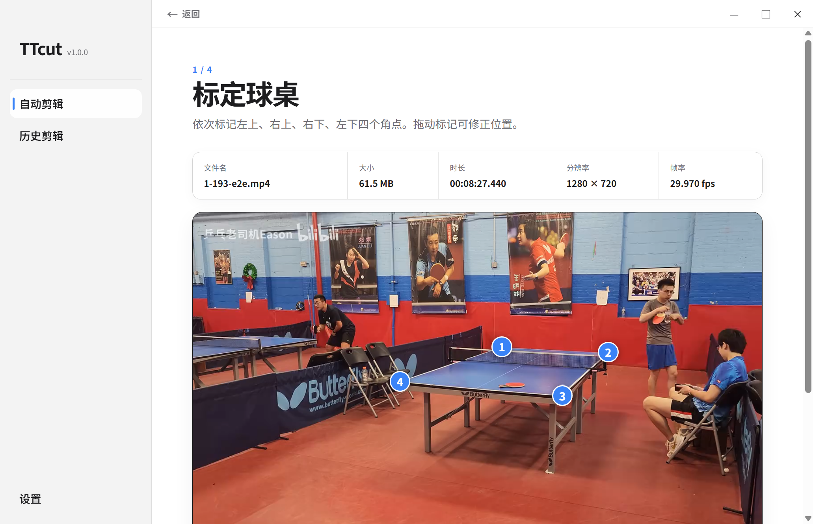
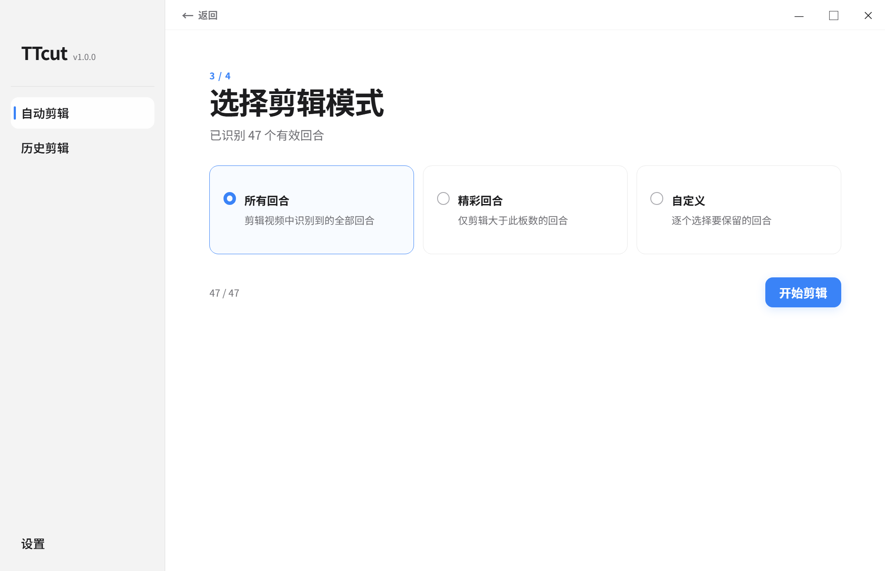

# TTcut

TTcut 是一款面向乒乓球爱好者的本地乒乓球视频自动剪辑工具。它从比赛视频中定位乒乓球、识别弹跳和有效回合，并按所选模式导出剪辑成片。

视频、分析结果和历史记录只保存在本机；软件不要求登录、不上传视频、不采集遥测。首次安装分析组件和视频处理组件需要联网，组件安装完成后可以离线分析、预览和剪辑。

> 当前 `v1.0.0` 为正式版本，支持 Windows 10 x64 和 Windows 11 x64。

## 下载与安装

1. 从  下载 `TTcut-1.0.0-x64-Setup.exe`。
3. 运行安装程序。安装完成后，从桌面或开始菜单的 `TTcut` 快捷方式启动。
4. 首次启动进入设置，同意后分别安装“分析组件”和“视频处理组件”。

分析组件会自动检测 NVIDIA GPU：CUDA 环境安装或自检失败时回退到 CPU。视频处理组件用于读取视频信息、剪辑、合并和验证输出。

## 欢迎大家加我微信 m2924931661

  欢迎反馈使用问题、bug反馈、新功能提交。
  
## 使用方法

### 1. 选择视频与标定球桌

- 在“自动剪辑”中选择或拖入一个 `.mp4` 文件。
- 使用视频进度条选择清晰画面。
- 按“左上、右上、右下、左下”的顺序点击球桌四角；编号点可以拖动修正。
- 确认四点没有重合、越界或错序后，点击“开始分析”。
- 标定或模式选择阶段可以使用标题栏左上角“返回”重新选择视频。



### 2. 等待本地分析

分析页面显示真实处理进度。任务运行期间可以取消；关闭软件时会提示退出、最小化或继续任务。没有识别到有效回合时，可以重新标定或更换视频。

### 3. 选择剪辑模式

- **所有回合**：剪辑全部有效回合。
- **精彩回合**：只保留板数大于所选筛选值的回合，筛选值为 3、5 或 7。
- **自定义**：逐项选择回合；每个回合均可预览。



### 4. 设置剪辑边界并导出

在“设置”中选择回合前时间和回合后时间，然后返回剪辑模式开始导出。输出保存在原视频目录：

- `match.mp4` 导出为 `match_ttcut.mp4`。
- 名称已存在时依次使用 `match_ttcut_2.mp4`、`match_ttcut_3.mp4`，不会覆盖原文件或已有结果。
- 导出完成后可直接播放成片，或使用“在文件夹中打开”定位文件。

### 5. 历史剪辑

成功分析的视频会保存本地分析记录和首帧封面。源视频未移动且内容未变化时，从“历史剪辑”打开记录可以直接进入剪辑模式，无需重新分析。

## 剪辑逻辑

- 相邻回合原始间隔小于 5 秒时合并为一个剪辑组；正好 5 秒或更长时分开。
- 每组只应用一次设置中的回合前时间和回合后时间。
- 每个剪辑组最后一个回合结束后额外保留 1 秒，再应用所选回合后时间；超过源视频结尾时直接在结尾结束。
- 扩展后的片段重叠时再次合并，避免重复画面。

## 分析组件

分析组件包含固定模型文件、Python 3.12.13、PyTorch 2.12.1、NumPy、OpenCV 和最小分析 Worker，负责：

- TrackNet 逐帧乒乓球定位。
- 四点球桌标定与坐标映射。
- 三帧/五帧弹跳检测和时间去重。
- 只基于弹跳事件的回合分组。

组件安装在 `%LOCALAPPDATA%\TTcutData\components`。模型文件从固定的 [权重 Release](https://github.com/WeiyePlayer/TTcut-runtime-assets/releases/tag/tracknet-weight-1.0.0) 下载并校验 SHA-256。设置页只显示分析组件整体状态和运行模式，不展示模型文件信息。

## 视频处理组件

视频处理组件采用固定的 FFmpeg/ffprobe Windows x64 构建，负责：

- 验证 MP4、时长、分辨率、帧率、音视频流和关键帧。
- 根据回合边界生成剪辑片段并合并。
- 满足安全切点条件时尝试流复制，否则执行一次准确重编码。
- 保留分辨率、方向、宽高比和色彩信息，并校验输出时长、音画同步和可播放性。

## 从源码运行

要求 Windows x64、Node.js 22、npm 10。安装依赖并启动：

```powershell
npm install
npm start
```

开发环境可以通过变量指定已有组件：

```powershell
$env:TTCUT_PYTHON='D:\path\to\python.exe'
$env:TTCUT_TRACKNET_WEIGHTS='D:\path\to\TrackNet_best.pt'
$env:TTCUT_FFMPEG='D:\path\to\ffmpeg.exe'
$env:TTCUT_FFPROBE='D:\path\to\ffprobe.exe'
npm start
```

验证与构建：

```powershell
npm run typecheck
npm test
python -m pytest worker/tests -q
npm run test:e2e
npm run verify:release
npm run make
npm run make:official
```

真实 E2E 不随仓库分发测试视频、模型权重或运行时。运行 `npm run test:e2e` 前，通过以下变量指定本机已验证的文件；`TTCUT_E2E_FFMPEG_ROOT` 指向同时包含 `ffmpeg.exe` 和 `ffprobe.exe` 的目录：

```powershell
$env:TTCUT_E2E_VIDEO='D:\path\to\1-193.mp4'
$env:TTCUT_E2E_PYTHON='D:\path\to\python.exe'
$env:TTCUT_E2E_WEIGHTS='D:\path\to\TrackNet_best.pt'
$env:TTCUT_E2E_FFMPEG_ROOT='D:\path\to\ffmpeg-bin'
$env:TTCUT_E2E_ELECTRON='D:\path\to\electron.exe'
npm run test:e2e
```

125%、150%、200% 的 Electron 布局用例用于当前机器上的自动化 DPI 回归检查，不构成跨 Windows 版本认证。系统、架构和组件兼容性由应用启动自检与任务前检查共同保证，详见 [Windows 兼容策略](docs/windows-compatibility.md)。

## 已知限制

- 当前只接受单个 MP4 视频。
- 板数是弹跳代理值，不是真实击球计数。
- 支持 Windows 10 22H2 x64（build 19045）和 Windows 11 x64（Client build 22000 及以上）；不支持旧版 Windows 10、x86、ARM64 和 Windows Server。

## 许可

TTcut 自有源码采用 [MIT License](LICENSE)。TrackNet 派生代码、模型权重、Python、PyTorch、NumPy、OpenCV、FFmpeg、字体和 npm 依赖保留各自许可或权利声明，详见 [THIRD_PARTY_NOTICES.md](THIRD_PARTY_NOTICES.md)。

更多实现和发行资料位于 [`docs`](docs) 目录。

## 打赏
如果本程序对你有帮助，希望能得到你的打赏支持，感谢！

爱发电：https://ifdian.net/a/weiye
