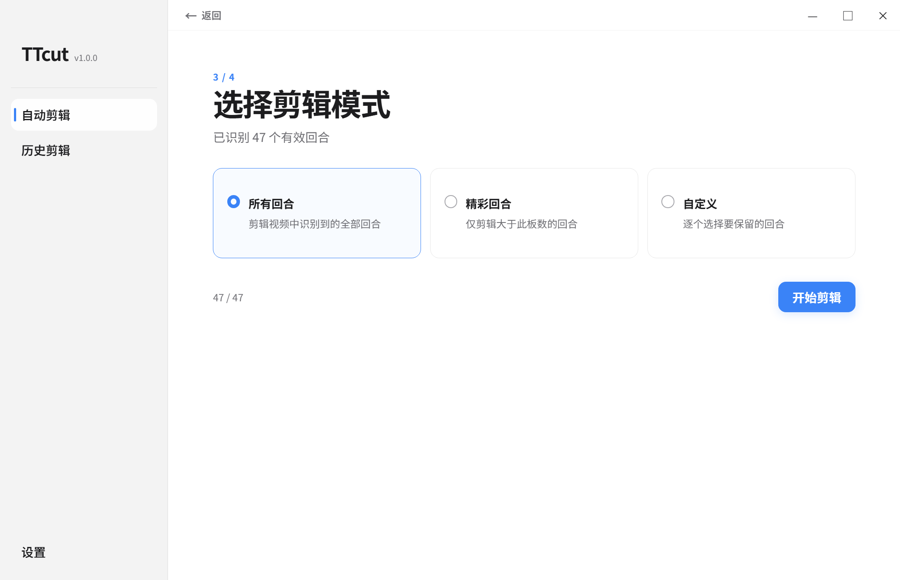

# TTcut

**简体中文** | [English](README.en.md)

TTcut 是一款面向乒乓球爱好者的本地乒乓球视频自动剪辑工具。它从比赛视频中定位乒乓球、识别弹跳和有效回合，并按所选模式导出剪辑成片。

视频、分析结果和历史记录只保存在本机；软件不要求登录、不上传视频、不采集遥测。默认分析模型随安装包提供；可选的新球识别模型按需下载。首次安装分析运行时和视频处理组件需要联网，组件安装完成后可以离线分析、预览和剪辑。

> 当前稳定版本为 `v1.2.0`，面向 Windows x64；应用不再按 Windows build 或系统版本进行硬拦截。

## 下载与安装

1. 从 [TTcut v1.2.0 Release](https://github.com/WeiyePlayer/TTcut/releases/tag/v1.2.0) 下载 `TTcut-1.2.0-x64-Setup.exe`。
2. 运行安装向导，选择安装根目录，并决定是否创建桌面快捷方式。程序写入 `<root>\app`，大型运行时、下载和导入暂存写入 `<root>\data\components`；开始菜单快捷方式始终创建。
3. 首次启动进入设置，同意后分别安装“分析组件”和“视频处理组件”。

分析组件会自动检测 NVIDIA GPU：CUDA 环境安装或自检失败时回退到 CPU。视频处理组件用于读取视频信息、剪辑、合并和验证输出。

## v1.2.0 更新

- 新增可选的 CUDA 高精度双检测模型，使用 SegFormer++ B2 主模型和 WASB 辅模型进行一致性过滤；TrackNet 仍是默认档位。
- 两个模型档位共享标定生成的动态 ROI。TrackNet 继续采用 1.25× 采样，新档位根据实际视频和 ROI 尺寸计算主辅输入。
- 新模型权重约 105 MB，仅在用户选择时从固定运行时资产下载，逐文件校验并原子安装，不写入 Git，也不打入安装包。
- 导出校验改为根据帧率、音频边界和合并片段数计算时长容差，减少多片段 VFR/AAC 视频被误判为导出失败；结构有效的异常输出会保留并提供恢复操作。
- 在自动剪辑、历史记录和设置之间切换时保留正在运行的单视频或批量任务；批量任务可选择在全部项目成功完成后自动关闭 Windows。

详见 [v1.2.0 发布说明](docs/release-notes-v1.2.0.md)。

## 欢迎大家加我微信 m2924931661

  欢迎反馈使用问题、bug反馈、新功能提交。
  
## 使用方法

### 1. 选择视频与标定球桌

- 在“自动剪辑”中选择或拖入一个 `.mp4` 或 `.mov` 文件。
- 默认使用自动标定；应用会抽取视频画面并自动识别球桌区域。
- 需要人工调整时切换到手动标定，使用视频进度条选择清晰画面。
- 按“左上、右上、右下、左下”的顺序点击球桌四角；编号点可以拖动修正。
- 确认四点没有重合、越界或错序后，点击“开始分析”。
- 标定或模式选择阶段可以使用标题栏左上角“返回”重新选择视频。


### 2. 等待本地分析

分析页面显示真实处理进度。任务运行期间可以取消；关闭软件时会提示退出、最小化或继续任务。没有识别到有效回合时，可以重新标定或更换视频。

### 3. 选择剪辑模式

- **所有回合**：剪辑全部有效回合。
- **精彩回合**：只保留板数大于所选筛选值的回合，筛选值为 3、5 或 7。
- **自定义**：逐项选择回合；每个回合均可预览。



### 4. 设置剪辑边界并导出

在“设置”中选择回合前时间和回合后时间，然后返回剪辑模式开始导出。输出保存在原视频目录：

- `match.mp4` 或 `match.mov` 均导出为 `match_ttcut.mp4`。
- 名称已存在时依次使用 `match_ttcut_2.mp4`、`match_ttcut_3.mp4`，不会覆盖原文件或已有结果。
- 导出完成后可直接播放成片，或使用“在文件夹中打开”定位文件。

### 5. 历史剪辑

分析完成的视频会保存本地分析记录和首帧封面，包括未识别到有效回合的记录。源视频未移动且内容未变化时，从“历史剪辑”打开记录可以直接进入剪辑模式，无需重新分析。

### 6. 批量任务

在“批量任务”中一次选择多个 MP4 或 MOV 视频。进入页面后，视频会按列表顺序先逐个自动标定；标定成功的项目进入等待，标定失败的项目封面中央显示“标定失败 / 手动标定”，点击后可复用四点标定页。手动完成后返回原队列并保留任务状态。点击“开始分析剪辑”只处理已就绪项目，待手动项目不会阻塞其他视频；输出保存到各源视频目录。

## 剪辑逻辑

- 相邻回合原始间隔小于 5 秒时合并为一个剪辑组；正好 5 秒或更长时分开。
- 每组只应用一次设置中的回合前时间和回合后时间。
- 每个剪辑组最后一个回合结束后额外保留 1 秒，再应用所选回合后时间；超过源视频结尾时直接在结尾结束。
- 扩展后的片段重叠时再次合并，避免重复画面。

## 分析组件

安装包内置固定的回合分析模型和球桌识别模型。按需安装的分析运行时组件包含 Python 3.12.13、PyTorch 2.12.1、NumPy、OpenCV 和最小分析 Worker，负责：

- TrackNet 逐帧乒乓球定位。
- 自动或手动球桌标定与坐标映射。
- 三帧/五帧弹跳检测和时间去重。
- 只基于弹跳事件的回合分组。

运行时组件安装在所选安装根的 `<root>\data\components`。两个模型随应用安装并在打包前按固定大小和 SHA-256 校验；Python/PyTorch 运行时仍按需下载，支持 CPU、CUDA 12.6 和 CUDA 13.2。

## 视频处理组件

视频处理组件采用固定的 FFmpeg/ffprobe Windows x64 构建，负责：

- 验证 MP4/MOV、旋转方向、时长、分辨率、帧率、音视频流和关键帧。
- 根据回合边界生成剪辑片段并合并。
- 满足安全切点条件时尝试流复制，否则执行一次准确重编码。
- 保留分辨率、方向、宽高比和色彩信息，并校验输出时长、音画同步和可播放性。

默认视频处理组件使用 OpenH264，在线安装行为和默认剪辑参数保持不变。需要 8K 或更高分辨率重编码时，可以在“设置”中下载并手动导入可选的 x264 组件：

- 固定文件：`ffmpeg-N-125716-g1b1f602699-win64-gpl.zip`
- 固定 SHA-256：`6dcf685c2fea98221b3f179961165e9c31f55bead576c4479ae4549858fbf826`
- 导入成功后，所有必须重编码的导出使用 `libx264`、`veryfast` 和 `CRF 18`。
- 满足边界条件的任务仍使用无损流复制，不会因为导入 x264 而强制重编码。
- x264 组件与默认 OpenH264 组件并存；x264 损坏或未导入时自动回退 OpenH264。
- x264 是 GPL 构建，组件不打入 TTcut 安装包，必须从设置页提供的固定 BtbN Release 手动下载并导入。
- 不进行升频：输入为 8K 时保持 8K，低分辨率视频不会被放大。

## 从源码运行

要求 Windows x64、Node.js 22、npm 10。安装依赖并启动：

```powershell
npm install
npm start
```

开发环境可以通过变量指定已有组件：

```powershell
$env:TTCUT_PYTHON='D:\path\to\python.exe'
$env:TTCUT_TRACKNET_WEIGHTS='D:\path\to\TrackNet_best.pt'
$env:TTCUT_FFMPEG='D:\path\to\ffmpeg.exe'
$env:TTCUT_FFPROBE='D:\path\to\ffprobe.exe'
npm start
```

验证与构建：

```powershell
npm run typecheck
npm test
python -m pytest worker/tests -q
npm run test:e2e
npm run verify:release
npm run make
npm run make:official
```

`npm run make` 保留 Forge 的 Vite 编译、打包与 Fuse 配置，并在 `out\make\nsis\x64` 生成当前版本的未签名 NSIS Setup、blockmap 和更新元数据；它不修改版本，也不上传 Release。`npm run make:official` 继续执行签名门禁，并生成由固定发布私钥签署的 `update-manifest.json` 与 `update-manifest.json.sig`。

真实 E2E 不随仓库分发测试视频、模型权重或运行时。运行 `npm run test:e2e` 前，通过以下变量指定本机已验证的文件；`TTCUT_E2E_FFMPEG_ROOT` 指向同时包含 `ffmpeg.exe` 和 `ffprobe.exe` 的目录：

```powershell
$env:TTCUT_E2E_VIDEO='D:\path\to\1-193.mp4'
$env:TTCUT_E2E_PYTHON='D:\path\to\python.exe'
$env:TTCUT_E2E_WEIGHTS='D:\path\to\TrackNet_best.pt'
$env:TTCUT_E2E_FFMPEG_ROOT='D:\path\to\ffmpeg-bin'
$env:TTCUT_E2E_ELECTRON='D:\path\to\electron.exe'
npm run test:e2e
```

125%、150%、200% 的 Electron 布局用例用于当前机器上的自动化 DPI 回归检查，不构成跨 Windows 版本认证。系统、架构和组件兼容性由应用启动自检与任务前检查共同保证，详见 [Windows 兼容策略](docs/windows-compatibility.md)。

## 已知限制

- 单视频工作流一次处理一个 MP4 或 MOV；批量任务支持一次选择多个 MP4/MOV，并按“先标定、后处理”的串行队列运行，失败项目可手动恢复。
- 板数是弹跳代理值，不是真实击球计数。
- 不再做 Windows build / 系统版本硬拦截；组件与二进制仍以 Windows x64 为主。旧版 Windows、x86、ARM64 能否实际运行取决于本机组件与依赖，不保证可用。

## 许可

TTcut 自有源码采用 [MIT License](LICENSE)。TrackNet 派生代码、模型权重、Python、PyTorch、NumPy、OpenCV、FFmpeg、可选 GPL x264 组件、字体和 npm 依赖保留各自许可或权利声明，详见 [THIRD_PARTY_NOTICES.md](THIRD_PARTY_NOTICES.md)。

更多实现和发行资料位于 [`docs`](docs) 目录。

## 打赏
如果本程序对你有帮助，希望能得到你的打赏支持，感谢！

爱发电：https://ifdian.net/a/weiye
