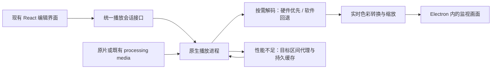

# 自定义页面即开预览：代码审查与实施方案

> 本文保留改造前的审查结论。用户随后确定采用 libmpv；实现及本机实测结果见 [libmpv 实施与验收记录](libmpv-preview-acceptance-2026-09-27.md)。下文“当前实现”均指文中基线提交。

审查日期：2026-09-27。基线：`fix/yulan`，`d501e29a9376744a0fedb1d55ed87d8b157e33a0`，审查前工作区干净。范围为当前源码与公开官方资料；本次不修改播放器实现，不将历史验证当作本次实测。

## 结论

当前长时间黑窗的主要原因是：Windows HEVC 被强制转换成完整 H.264 预览文件，转码及验证完成后才发布播放地址。这条链路的等待量随视频总时长增长，不适合作为所有 HEVC 素材的默认打开方式。

推荐把自定义页面升级为原生按需播放：读取容器索引、解码当前播放点附近的帧、硬件解码优先、软件解码回退、实时色彩转换；预览代理仅用于性能不足时的按需降级。保留 Electron / React 的编辑界面与现有片段领域逻辑。播放内核优先评估 libmpv，GPU 画面接入必须先通过真实 Electron 原型验证。

对于完整、可读且具有正常索引的本地文件，目标是无需整片预处理即可显示首帧、播放和跳转。不能承诺任意损坏文件、任意编码或低配设备上的任意 8K 高帧率视频都能零延迟、满帧播放；专业剪辑软件也受解码器、显卡和存储性能约束。

## 当前实现的证据

| 问题 | 代码位置 | 影响 |
| --- | --- | --- |
| Windows HEVC 无条件进入代理准备 | `src/renderer/use-compatible-preview.ts:16`、`:168` | 即使该设备能播放原片，也先执行转换；MP4 中的 HEVC 同样触发 |
| 等待整片转码和验证 | `src/main/preview-media.ts:122`、`:126`、`:129`、`:150` | 先探测、完整 FFmpeg 转码、再探测和校验，最后改名并返回路径 |
| 准备时主动暂停并覆盖监视器 | `src/renderer/use-compatible-preview.ts:117`、`src/renderer/CustomCutPage.tsx:730` | 画面不能与代理生成并行使用 |
| 重启后不复用 Windows 预览缓存 | `src/main/preview-media.ts:115`、`:170` | 缓存存于临时目录，内存 Map 合并请求，正常退出时删除；同一进程内可复用，跨重启通常重新生成 |
| 探测可能读取整片 | `src/main/probe.ts:87`、`:130` | 缺少 `nb_frames` 时执行 `-count_frames`；首帧链路不应依赖此类完整统计 |
| Windows HDR 没有正确转换流程 | `src/main/preview-media.ts:83` | 当前只有 scale / fps / yuv420p / 色彩范围设置，没有 PQ/HLG 的线性化、色调映射与色域转换 |
| 预览等待还阻塞导出按钮 | `src/renderer/CustomCutPage.tsx:785` | 已有合法选段也被 `preparing` 禁用；预览就绪与导出前置条件需要分开 |
| 当前媒体传输已支持随机读取 | `src/main/media-protocol.ts:42` | 已有 Range / 206；问题并非简单缺少流式文件读取 |

“所有视频都强制转换”不是当前代码的条件：必选分支是 Windows HEVC，其他编码会在媒体错误、缺少视频尺寸或无帧推进时进入兼容恢复。截图只能证明处于准备状态，不能确定这批文件的编码，也不能证明正在运行的安装包与此 checkout 完全一致。

`CustomCutPage.tsx:267` 会按实际播放路径选择原片或分析媒体的编码信息，不应简单删除这项区分。历史记录、原片和 CFR processing media 的时间轴与身份关系必须继续保持。

macOS 也不是全部即开：`CompatibleVideo.tsx:34` 对 HDR 主动生成预览，`src/main/macos/preview.ts:23` 等待生成结束后返回地址。macOS 已有色调映射和持久缓存，但仍需区别“原生媒体服务生成代理”和“原生实时播放”。

## 剪辑软件为什么可以导入后预览

核心在于直接处理原始编码，播放到哪里才解码哪里，利用 GPU 加速；索引、波形和代理可以另行处理。代理是减轻重素材负载的工作流，不要求所有素材先转完才能出现画面。

Adobe 官方说明 Premiere 支持原生格式编辑而无需先转码，并针对 H.264/HEVC 提供硬件解码。代理工作流允许导入处理在后台进行时继续编辑。这里说明的是公开工作方式，并不推断 Adobe 未公开的内部实现。

- [Premiere 原生格式编辑说明](https://helpx.adobe.com/premiere/desktop/get-started/tour-the-workspace/adobe-premiere-faq.html)
- [硬件解码支持范围](https://helpx.adobe.com/sg/premiere/desktop/get-started/technical-requirements/supported-codecs-and-drivers-for-hardware-accelerated-decoding.html)
- [后台导入和代理工作流](https://helpx.adobe.com/id_id/premiere/desktop/organize-media/ingest-proxy-workflow/configure-ingest-settings.html)

MP4 / MOV 是容器；兼容判断还必须包括视频和音频编码、位深、色度采样、色彩传递函数、旋转、时间戳等。更换后缀或只做重新封装不会把 HEVC 变成 H.264。

## 方案取舍

| 路线 | 打开与跳转 | 兼容性与成本 | 结论 |
| --- | --- | --- | --- |
| 加速现有完整转码、提前转码或持久缓存 | 缓存命中变快；首次仍依赖总时长 | 改动小，但保留根本等待 | 可辅助，不能独立满足目标 |
| HTML video 原片直放，失败后按需分段代理 | 能直放的立即用；其他素材等待目标附近短片段 | 保留现有 UI；需要分段调度、时间戳与音频连续性处理 | 可作为过渡与故障降级 |
| 原生播放内核直接读原片 | 正常索引下只需准备当前位置的帧；跳片尾不用先转前面的内容 | 广泛解码能力、可控 HDR；需要原生运行时与 GPU 合成适配 | 推荐的正式架构 |

单独使用 Video.js、ReactPlayer 等 HTML video 包装层不增加系统底层解码能力。WebCodecs 也不能自动解决所有设备的 HEVC/profile 支持和音画同步。只去掉强制 HEVC 判断会重新暴露此前的原生播放失败；需要可靠替代路径之后再移除。

`+faststart` 已在当前代码中使用。它移动 MP4 索引，并不让此处“等待 runProcess 完成后才返回地址”的服务提前可用。换成分片 MP4 也仍需重新设计发布、缓冲和任意位置请求；从头顺序转码不能解决用户立即跳到片尾的问题。[FFmpeg 格式文档](https://ffmpeg.org/ffmpeg-formats.html#mov_002c-mp4_002c-ismv)

## 推荐架构与约束

### 1. 快速打开与原生解码

- 快速探测仅获取打开所需的轨道、时长、索引和色彩属性；复用已验证且身份匹配的分析元数据。
- 不在首帧关键路径执行 `-count_frames`、全量关键帧扫描或等待完整 VFR 检测。分析需要的完整统计继续由分析流程承担。
- 通过原生库读取 MP4/MOV 和解码，而不是依赖浏览器恰好支持该文件。优先评估 libmpv，复用其播放、同步和跳转机制。
- Windows 优先评估 D3D11VA；硬件初始化或运行中出错时，在同一源时间位置恢复软件解码，并保留最后一次播放/暂停意图。超时不能被重复事件无限续期，恢复次数有界。
- 正常预览不经过“再编码 H.264 → 写整片文件 → 浏览器再解码”链路。

mpv 官方文档列出了硬件解码及软件回退和色调映射能力，但这些能力仍须在选定的嵌入后端、构建和设备上验证。[mpv 手册](https://mpv.io/manual/stable/)

### 2. GPU 画面接入是首个技术验证点

本仓库声明 Electron `43.1.1`；本地 `electron.d.ts` 已有 `sharedTexture.importSharedTexture`、Windows `ntHandle` 和多种像素格式。可评估原生进程生成共享 GPU 纹理，经 Main / Preload 的受限桥交给渲染界面，保留比分、选区及鼠标交互叠加。

不能把这当作已经打通的连接：Electron 官方将 sharedTexture 标为 Experimental；当前 libmpv render API 公开后端主要是 OpenGL 与软件渲染，不是现成的 D3D11 共享纹理输出接口。OpenGL / D3D 互操作、纹理生命周期、同步和色彩空间均需验证。若此路径不可接受，保持同一播放会话接口，评估 FFmpeg 库加可共享纹理的原生渲染器；其音画同步与播放调度实现成本更高。

原型必须在真实自定义页面验证比分叠加、DPI/窗口缩放和失焦恢复。外部 mpv 窗口能播放、或者把子 HWND 放到视频区域里，都不能单独证明 Electron 内嵌体验完成。避免把高分辨率逐帧图像经 JSON/base64 搬运作为正式方案。

- [Electron sharedTexture](https://www.electronjs.org/docs/latest/api/shared-texture)
- [libmpv render API](https://raw.githubusercontent.com/mpv-player/mpv/master/include/mpv/render.h)

### 3. HDR 与高分辨率

- HDR10 / PQ 与 HLG 必须有明确色彩路径。在普通 SDR 屏幕或 SDR 合成路径上实时进行 tone mapping 和色域转换，不能只改为 8 位 yuv420p。
- HDR 输入兼容和 HDR 显示输出分开验收：正确 SDR 预览可作为通用基线；真 HDR 输出必须验证系统 HDR、显示器、10 位或浮点纹理及 Electron 合成链路，不能把 SDR 预览称为 HDR 输出。
- Dolby Vision / HDR10+ 单列样本和 profile；检查基础层及动态元数据处理能力，对不支持的路径明确报告，不能默认等同于普通 HDR10。
- 高分辨率优先硬件解码、GPU 缩放和小规模帧缓存；缓存按字节和时间限制，而不随视频总长度无限增长。
- 缩小显示尺寸通常不能消除源编码的完整解码成本。软件解码仍慢时允许降低预览帧率，并按需准备低分辨率代理，不承诺弱设备原片满帧。

### 4. 代理降级不再阻塞整片

- 请求当前时间附近的短窗口，例如初始以 2–4 秒作为调优起点，再按播放速度向前预取。窗口长度由实测调整。
- 用户跳到第 50 分钟时，利用索引定位目标之前的关键帧，解码到所需 PTS，优先生成目标窗口；不等待前 50 分钟转换。没有正常索引或 GOP 很长时，允许有额外等待并记录原因。
- 对旧请求取消或降低优先级；会话 ID / seek 序号防止过期画面覆盖最新选择。维护源 PTS、代理局部时间、音频起点、VFR 和旋转的映射。
- 单个独立短片段可闭合后播放；连续分段播放需要处理关键帧、时间戳和音频连续性。若采用浏览器承载，另行实现 MSE 缓冲与任意位置调度，不能只反复替换 URL 冒充连续播放。
- 持久缓存带容量上限、最近使用淘汰和主动清理；key 包含源身份、策略版本、窗口、分辨率、色彩策略等。读取时验证源变化，未完成片段不作为成功缓存发布。
- 当前范围也无法实时解码时只能展示真实缓冲/降级状态；后台转码不会绕过同一个源解码瓶颈。

### 5. 与现有编辑逻辑的结合

- 增加统一 `PreviewSession`：`open / play / pause / seek / close`，以及 `firstFrame / presentedTime / seeking / buffering / error` 事件；播放器不再只返回完整预览文件 URL。
- 将 `use-custom-playback.ts` 对 `HTMLVideoElement` 的依赖改为播放接口。保留 `src/domain/custom-playback.ts` 的回合、原片播放和片段选择规则。
- 使用真实呈现帧的 PTS 驱动时间线与回合边界，不能拿 IPC 命令完成或计时器代替画面已到达。拖动时合并请求，松开时准确定位。
- 将 `CustomCutPage.tsx` 的 `requestVideoFrameCallback`、`seeking` 与 `<video>` 事件适配到统一接口；连续播放、回合跳转和比分叠加一起验证。
- Main 根据已注册媒体 token 解析路径并校验请求；Renderer 不直接打开任意路径或启动解码进程。原生进程异常不得带崩整个编辑器。
- 预览状态与导出可用性分开；导出继续遵守源媒体、选段和组件校验，预览降级不能把低分辨率缓存替换成正式输出源。
- 标定与结果预览可随后复用相同会话接口；macOS 的现有功能必须回归，避免双重代理生成或重复 tone mapping。

## 实施顺序与交付门槛

1. **验证播放及合成可行性**：在实际 Electron 版本与自定义页面内播放原始 H.264、HEVC 10 位和 HDR 样片；证明硬/软解码、随机跳转、比分叠加与首帧显示。完成原生运行时构建、固定版本及分发依赖评估。未通过前不替换生产播放器。
2. **迁移播放接口**：引入会话 IPC、快速探测与 UI 适配；保留当前恢复路径作为迁移期后备；验证回合播放意图、时钟及准确跳转后，再移除 Windows HEVC 的无条件整片转换。
3. **完成性能降级**：实现目标区间代理、持久缓存、取消和资源预算；长片冷启动及跳片尾都不能依赖整片任务完成。缓存优化不能代替第 1、2 步。
4. **真实媒体验收**：通过以下矩阵再确认可交付；不以 mock 测试、转码成功或出现 metadata 事件代替真实画面。

建议验收指标（目标值，尚未实测；需记录机器与样本）：本地 SSD、硬解受支持的常见 H.264/HEVC 1080p 和 4K 素材，冷打开首帧 p95 ≤ 2 秒，正常随机跳转目标画面 p95 ≤ 1 秒；同类 1 分钟与 1 小时素材不出现与总时长成比例的首帧等待。长 GOP、软件解码及降级路径单独统计，不混入正常路径掩盖问题。

| 维度 | 必测内容 |
| --- | --- |
| 容器与编码 | MP4/MOV 中的 H.264、HEVC Main/Main10；MOV ProRes；不同支持情况的 4:2:0/4:2:2 样本 |
| 色彩 | SDR、PQ/HDR10、HLG、手机 Dolby Vision、HDR10+；SDR 显示正确性与 HDR 输出独立验证 |
| 分辨率与长度 | 1080p、4K60、8K 样本；短片和 1 小时以上长片；峰值内存、GPU 占用与磁盘缓存 |
| 解码回退 | Intel/AMD/NVIDIA 的代表设备；强制软件解码；硬解失败与进程恢复 |
| 时间与音频 | VFR、29.97/59.94、非零起始 PTS、长 GOP、旋转视频、AAC/PCM/无音频；音画偏差与定位误差 |
| 实际交互 | 首帧视觉确认、首段播放、未预热片尾跳转、连续前后拖动、回合边界、比分叠加、暂停意图保留 |
| 缓存与生命周期 | 冷启动、重启复用、文件变化、磁盘满、切换媒体、关闭页面、应用退出 |

首帧必须是已呈现的视频画面；seek 完成必须验证目标画面和 PTS；HDR 需要真实图像/显示对照。播放器升级不自动证明分析、导出或安装包已经通过验证。

## 本次完成与未验证部分

已完成当前源码审查、关键调用链和现有测试用例阅读、官方资料核对及方案记录。没有改动生产源码，没有运行新的 Electron 播放实验、视频转码、性能测试或安装包构建；上述新架构与时间指标均待实施验证。
